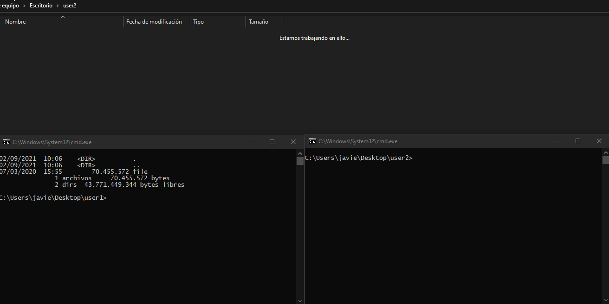

<h1 align="center">Netdrop</h1>
<p align="center"><b>Like AirDrop, but this one runs on Python</b></p>

After using the disgustingly slow file sharing over bluetooth "app" that Windows 10 has, a friend of mine (@MikenTNT) came up with this idea of **making something better in Python**.

The initial implementation was done using **websockets**, but the latest release uses regular sockets to improve the transmission speeds (at least 2x).

It is able to share files at an average of **20MB/s** (gazillion times faster than the Windows 10 "app").

**The goal wasn't to build the best file transfer tool, but to build one myself using websockets and Python, and learning a lot in the process (Done)**.

After that, like I just said, I refactored the code to use regular sockets and encryption using RSA and AES, so it's safer and faster. (I also learned a lot working with broadcast packets, threads and encryption).

## Supported systems

It runs on anything that has **Python3** installed on it. Just install the requirements with the following commands:

```bash
python3 -m pip install --upgrade pip
python3 -m pip install -r requirements.txt
```

## Usage
```
NAME
        Netdrop - Transfer files the easy way
SYNOPSIS
        netdrop.py -f <FILE> [OPTIONS]
DESCRIPTION
        Transfers a file between hosts of the same subnet.
        Quick and safe, using RSA and AES encryption.

        Mandatory arguments:
        -f FILE
                File to transfer (download/upload)
        Optional arguments:
        -v      be more verbose
        -h      print this help and exit
```

## Example



#### Sender

```bash
python3 netdrop.py -f file
```

#### Receiver
```bash
python3 netdrop.py -f file
```

## How it works

To use it, both users need to run the tool with the same argument, that is, the same filename, and they have to be connected to the same subnet.

If the file exists, the tool will work in server mode, if otherwise, in client mode.

The tool will automatically search for active hosts across the subnet and try to connect to alive netdrop servers, listening on high ports (30000, 30001).

It generates a RSA key pair and a random AES key. The RSA keys are only used so the AES key can be transmitted safely across the network. Once that is done, the AES key will be used to encrypt all of the packets sent between the computers.

## License

MIT License

Copyright (c) 2021 Javier Vidal Ruano

Permission is hereby granted, free of charge, to any person obtaining a copy
of this software and associated documentation files (the "Software"), to deal
in the Software without restriction, including without limitation the rights
to use, copy, modify, merge, publish, distribute, sublicense, and/or sell
copies of the Software, and to permit persons to whom the Software is
furnished to do so, subject to the following conditions:

The above copyright notice and this permission notice shall be included in all
copies or substantial portions of the Software.

THE SOFTWARE IS PROVIDED "AS IS", WITHOUT WARRANTY OF ANY KIND, EXPRESS OR
IMPLIED, INCLUDING BUT NOT LIMITED TO THE WARRANTIES OF MERCHANTABILITY,
FITNESS FOR A PARTICULAR PURPOSE AND NONINFRINGEMENT. IN NO EVENT SHALL THE
AUTHORS OR COPYRIGHT HOLDERS BE LIABLE FOR ANY CLAIM, DAMAGES OR OTHER
LIABILITY, WHETHER IN AN ACTION OF CONTRACT, TORT OR OTHERWISE, ARISING FROM,
OUT OF OR IN CONNECTION WITH THE SOFTWARE OR THE USE OR OTHER DEALINGS IN THE
SOFTWARE.
